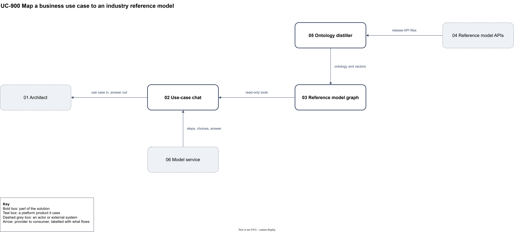

# UC-900 Map a business use case to an industry reference model

<!-- deck:cover subtitle="An architect pastes a business use case and gets the reference model's service domains, interfaces and data sets it needs, with evidence" date="1 October 2026" footnote="Worked example. Illustrative only." -->

| Field | Value |
|---|---|
| Use case | UC-900 |
| Consumer | Solution and enterprise architects |
| Owner | The architecture lead |
| Outcome | A traceable first pass of the reference model's service domains, interfaces and business objects a use case needs, in minutes instead of days |
| Rests on | Assumption: a model choosing only among retrieved reference model candidates reaches recall 0.8 and precision 0.7 on a gold set |
| Realised by | None yet |
| Date | 2026-10-01 |

<!-- deck:slide label="In one sentence" -->

## The solution in one sentence

An architect pastes a business use case into a chat that reasons over an ontology distilled from an industry reference model, to get the service domains, interfaces and data sets the use case needs, so that design starts from a traceable draft rather than a blank page.

Today an architect reading "a customer orders online, with a stock check, a payment and a delivery booking" has to work out which of the reference model's hundreds of service domains act, which of their thousands of operations are called, and which objects pass between them. It takes days, it depends on who knows the reference model best, and the result is rarely traceable to the standard.

### What is different afterwards

The architect reviews and corrects a draft that cites the reference model on every row, instead of compiling it. Two architects working on the same use case start from the same evidence.

<!-- deck:slide label="On one page" title="The solution on one page" -->

## Diagram

## Participants

| Participant | Role in this use case | Kind |
|---|---|---|
| 01 Architect | Pastes the use case, corrects the steps, reviews the answer | actor |
| 02 Use-case chat | Splits the use case into steps and assembles the answer through read-only tools | solution |
| 03 Reference model graph | Service domains, operations and business objects in a graph database, with definition embeddings | solution |
| 04 Reference model APIs | Published OpenAPI files under an open licence | external |
| 05 Ontology distiller | Turns the API files into OWL with provenance | solution |
| 06 Model service | Splits steps, chooses among candidates, writes the answer | external |

## Interactions

| Interface | Provider | Consumer | Purpose |
|---|---|---|---|
| IF-01 | 02 Use-case chat | 01 Architect | use case in, answer out |
| IF-02 | 03 Reference model graph | 02 Use-case chat | read-only tools |
| IF-03 | 06 Model service | 02 Use-case chat | steps, choices, answer |
| IF-04 | 04 Reference model APIs | 05 Ontology distiller | release API files |
| IF-05 | 05 Ontology distiller | 03 Reference model graph | ontology and vectors |

## Scenarios

Step through the flows in the [animated walkthrough](./scenarios.html).

<!-- deck:html src="./scenarios.html" title="The flow" header="true" -->

### S1 Main success scenario

| Step | Actor | Target | Action | Interface |
|---|---|---|---|---|
| 1 | 01 Architect | 02 Use-case chat | paste the use case | IF-01 |
| 2 | 02 Use-case chat | 06 Model service | split it into business steps, shown to the architect | IF-03 |
| 3 | 02 Use-case chat | 03 Reference model graph | retrieve candidate service domains for each step | IF-02 |
| 4 | 02 Use-case chat | 06 Model service | choose among the candidates only, with reasons | IF-03 |
| 5 | 02 Use-case chat | 03 Reference model graph | fetch the chosen domains' operations and business objects | IF-02 |
| 6 | 02 Use-case chat | 01 Architect | show steps, domains, interfaces and data sets, each with its reference model id, and the gaps | IF-01 |

### S2 Load a reference model release

| Step | Actor | Target | Action | Interface |
|---|---|---|---|---|
| 1 | 05 Ontology distiller | 04 Reference model APIs | read the release's API files | IF-04 |
| 2 | 05 Ontology distiller | 03 Reference model graph | load the ontology, its provenance and definition vectors | IF-05 |

<!-- deck:slide label="What it returns" -->

## What it returns

| Output | Content |
|---|---|
| Steps | The use case split into business steps, in the architect's words |
| Service domains | For each step, the domains that act, with the reference model's definition and why each was chosen |
| Interfaces | The operations called (domain, control record or behaviour qualifier, action term), in step order |
| Data sets | The business objects each interface takes and returns, with the properties that carry the use case's data |
| Gaps and doubts | Steps no domain covers, and choices the model was unsure of |
| Evidence | Every row's reference model identifier and release |

## Scope

| First version | Later | Explicitly out of scope |
|---|---|---|
| One reference model release distilled from its openly licensed APIs; five read-only tools; a page showing the tables; a 30-case gold set and harness | Model-proposed hierarchy and links to neighbouring standards; sequence diagrams and pattern scaffolds from an answer; one release against the next | The reference model's licensed content until terms are confirmed; API design beyond the reference model; per-user access |

## Data it needs

| Interface | Source | What | Sensitivity | Acts under whose permissions |
|---|---|---|---|---|
| IF-01 | The architect | The use case text | Internal; may describe unreleased products | The architect's |
| IF-04 | The standards body | The release's API files | Public, openly licensed | None needed |

## Systems it reads or acts on

| Interface | System | Reads or writes | Sync or async | Governed path today? |
|---|---|---|---|---|
| IF-02 | Reference model graph (a graph database) | Reads | Sync | Read-only transaction |
| IF-03 | Model service | Reads | Sync | Yes, through the account's model access |

<!-- deck:slide label="Dependencies" -->

## Dependencies

| What it needs | From | Route | Ready? |
|---|---|---|---|
| A graph store with read-only access and a vector index | A platform team | Use as is | Ready |
| Governed access to a language model | A platform team | Change: add the model to the allowed list | Dependency |

<!-- deck:slide label="Measures" -->

## Measures

| Measure | Target for the first version |
|---|---|
| Service domain recall on the gold set | At least 0.8 |
| Service domain precision | At least 0.7 |
| Rows traceable to the reference model | 100% |
| Answer time | Under a minute for a paragraph |
| Cost | Under USD 0.25 a question |

<!-- deck:slide label="Risks and decisions" -->

## Risks and assumptions

| Claim that could be false | So what | How it will be tested |
|---|---|---|
| Retrieval over definitions finds the right domains | The model can only choose what retrieval offers | Recall of retrieval alone on the gold set |
| The reference model's API files are enough without its licensed content | Grouping and definitions may be thin | Compare against the licensed content if membership is taken |
| A derived ontology may be published | The chat could not be shared | Read the standards body's IP policy |

### Open decisions

| Decision, between named options | Who decides | By when |
|---|---|---|
| The APIs' own object model or a message-standard flavour of them | The architecture lead | After the distillation spike |
| Stand-alone chat, or part of an existing knowledge product | The architecture lead | After the first version |

<!-- deck:slide label="Next step" -->

## Next step

Proceed to design. The shape is settled and nothing blocks the first slice: distil one reference model release from its public API files, then build the chat on a graph store. About three to four weeks to the first version. What would change it: retrieval recall on the gold set below 0.8, which would send the design back to the ontology.

## Catalogue Mapping

| Local ID | Maps To | Relationship |
|---|---|---|
| 01 | | gap |
| 02 | | gap |
| 03 | | gap |
| 04 | | gap |
| 05 | | gap |
| 06 | | gap |
